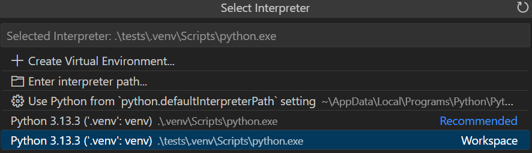
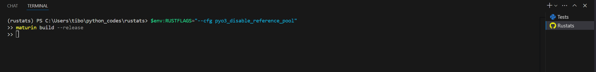
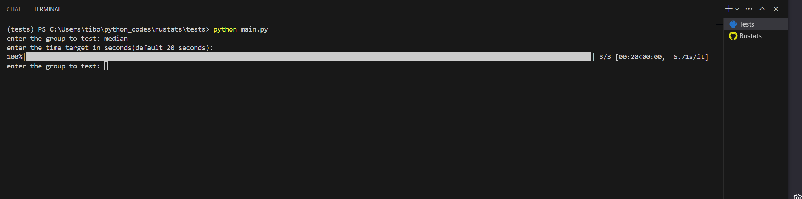
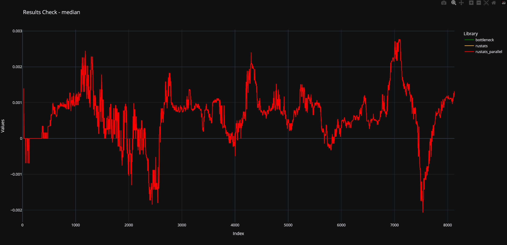
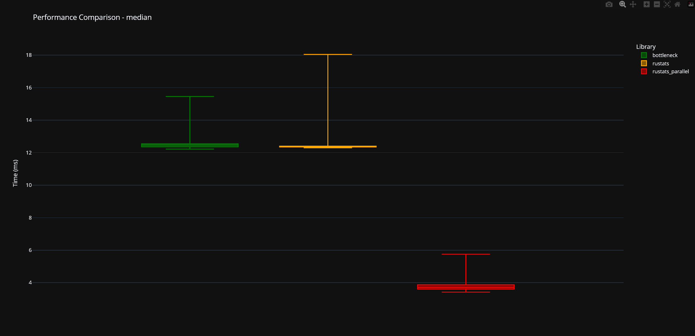
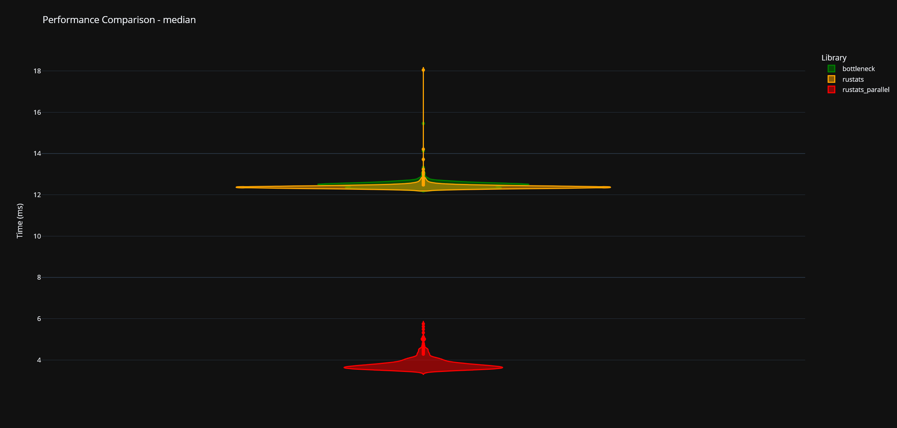

# Rustats

## Installation

````
uv add git+https://github.com/OutSquareCapital/rustats.git
````

## Testing and developpement

Build with

````
$env:CARGO_PROFILE_RELEASE_OPT_LEVEL="3"
$env:RUSTFLAGS="--cfg pyo3_disable_reference_pool"
maturin build --release
````

Once the project is built and the pyproject version # is updated, commit the changes.

Then, update the version of the testing folder with

````
rustats\tests> uv sync --upgrade
````

Ensure you select the rigth .venv (rustats\tests) for testing.

````
& rustats/tests/.venv/Scripts/Activate.ps1
````




- First one is for maturin, you don't care very much about it
- Always select the second one

Ensure you have 2 powershell terminals, one in rustats, the other in rustats\tests. You can rename them for convenience.



When testing, you will be prompted the group you want to test and the time target.

Once the test is run, you can check the stats and results correctness against benchmarks (bottleneck and numbagg).

### Example



#### Output

##### Checking exactitude



##### Boxplot performance comparison



##### Violins performance comparison



You can check in tests\benchmark_summary.ndjson what was the actual nb of passes for the last run (WIP)

````json
{"group":"var","total_time_secs":5.44,"n_passes":1072,"time_per_pass_ms":5.074}
{"group":"mean","total_time_secs":5.032,"n_passes":1336,"time_per_pass_ms":3.766}
{"group":"std","total_time_secs":4.979,"n_passes":685,"time_per_pass_ms":7.269}
{"group":"max","total_time_secs":5.157,"n_passes":731,"time_per_pass_ms":7.054}
{"group":"min","total_time_secs":4.777,"n_passes":698,"time_per_pass_ms":6.844}
{"group":"rank","total_time_secs":4.431,"n_passes":23,"time_per_pass_ms":192.664}
{"group":"sum","total_time_secs":18.714,"n_passes":5281,"time_per_pass_ms":3.544}
{"group":"median","total_time_secs":20.112,"n_passes":697,"time_per_pass_ms":28.856}
````
