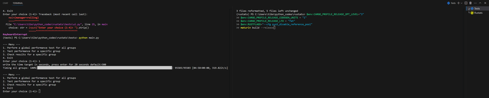
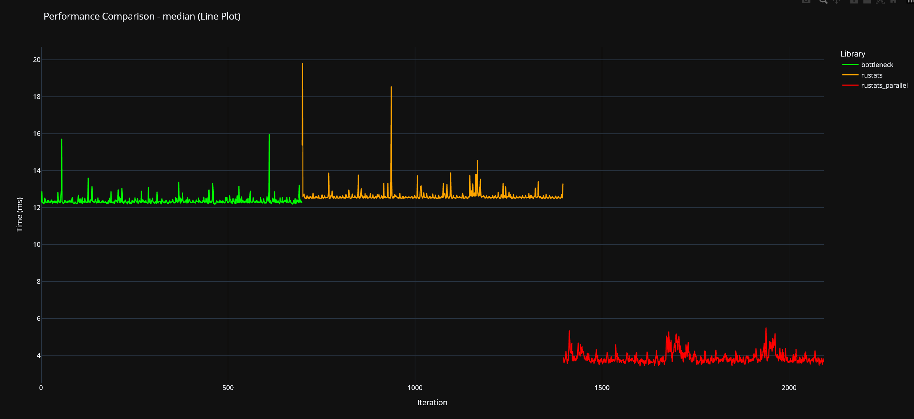
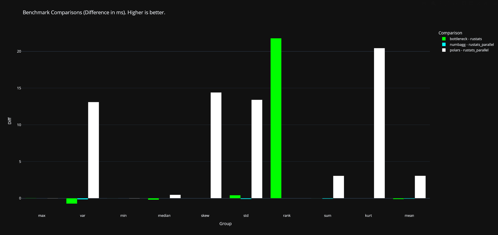

# Rustats

Rustats is a WIP Python library that re-implements functions available in polars, bottleneck, and numbagg. 
Designed specifically for 2D numpy arrays holding floats, all the code implementation is done in Rust, allowing high performance, memory safety, and a code which is IMO much clearer than any C implementation. 

## Performance

- Matches bottleneck speed on a single thread, with Polars it depends.
- Faster than bottleneck when running in parallel, as well as Polars (except for a few functions, but it's most likely due to algorithm specific implementations)
- Currently slower than numbagg. However Rustats does not have a first call overhead from numba JIT compilation.
- Provides modern type hints for all functions(something that unfortunately lacks for bottleneck and numbagg/numba).

## Usage example

Most functions share this signature
````python
def move_sum(
    array: NDArray[np.float64], length: int, min_length: int, parallel: bool
) -> NDArray[np.float64]: ...
````
To use it simply do this:

````python
import rustats as rs
import numpy as np

result = rs.move_sum(
    array=np.random.rand(10000, 10), 
    length=250, 
    min_length=25, 
    parallel=True
    )
````

To run it in parallel, simply provide True to the argument for a big performance boost. 
But if you have multiple threads already running (with concurrent futures for example), specifying False is recommended.


## Installation

````
uv add git+https://github.com/OutSquareCapital/rustats.git
````

## Testing and developpement

Build with

````
$env:CARGO_PROFILE_RELEASE_OPT_LEVEL="3"
$env:CARGO_PROFILE_RELEASE_CODEGEN_UNITS = "1"
$env:CARGO_PROFILE_RELEASE_LTO = "fat"
$env:RUSTFLAGS="--cfg pyo3_disable_reference_pool"
maturin build --release
````

Cargo profile env variables don't seem to change anything ATM, but are indeed taken into account for compilation.

Once the project is built and the pyproject version # is updated, commit the changes.

Then, update the version of the testing folder with

````
rustats\tests> uv sync --upgrade
````

Ensure you select the rigth .venv.

````
& C:/Users/tibo/python_codes/rustats/tests/.venv/Scripts/Activate.ps1 # for compiling
& C:/Users/tibo/python_codes/rustats/tests/.venv/Scripts/Activate.ps1 # for testing
````


- First one is for maturin, you don't care very much about it
- Always select the second one

Ensure you have 2 powershell terminals, one in rustats, the other in rustats\tests. You can rename them for convenience.



When testing, you'll be able to choose wether launching a global test, or a benchmark for a specific group. 

You can specify a time duration target (for quick tests flexibility), wether it's a global or specific test.

The number of functions call will be adjusted accordingly.

Currently the distribution plots are filtered to exclude +95th percentile times.

### Example

````
(tests) PS C:\Users\tibo\python_codes\rustats\tests> python main.py

--- Menu ---
1. Perform a global performance test for all groups
2. Test performance for a specific group
3. Check results for a specific group
4. Exit
Enter your choice (1-4): 2
Enter the group to test: median
write the time target in seconds, press enter for 20 seconds default:
Timing median - rustats_parallel: 100%|███████████████████████████████████████████████████████████████████████████████████████████████████████| 2094/2094 [00:20<00:00, 103.49it/s]
````

#### Output

##### Checking exactitude


##### Boxplot performance comparison


##### Violins performance comparison


#### Visualizing each iteration time



#### With global test




### Saved data

You can check in tests\benchmark_summary.ndjson what was the actual nb of passes for the last run (WIP)

````json
{"group":"var","total_time_secs":5.44,"n_passes":1072,"time_per_pass_ms":5.074}
{"group":"mean","total_time_secs":5.032,"n_passes":1336,"time_per_pass_ms":3.766}
{"group":"std","total_time_secs":4.979,"n_passes":685,"time_per_pass_ms":7.269}
{"group":"max","total_time_secs":5.157,"n_passes":731,"time_per_pass_ms":7.054}
{"group":"min","total_time_secs":4.777,"n_passes":698,"time_per_pass_ms":6.844}
{"group":"rank","total_time_secs":4.431,"n_passes":23,"time_per_pass_ms":192.664}
{"group":"sum","total_time_secs":18.714,"n_passes":5281,"time_per_pass_ms":3.544}
{"group":"median","total_time_secs":20.112,"n_passes":697,"time_per_pass_ms":28.856}
````
